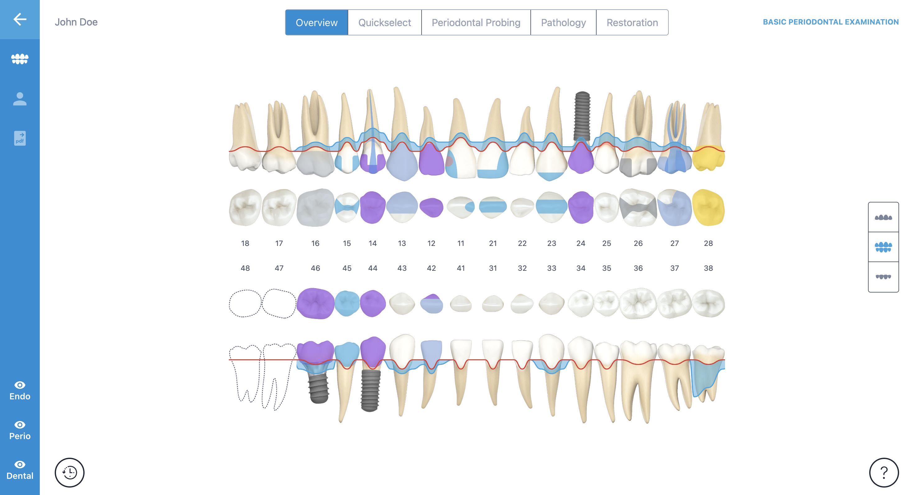
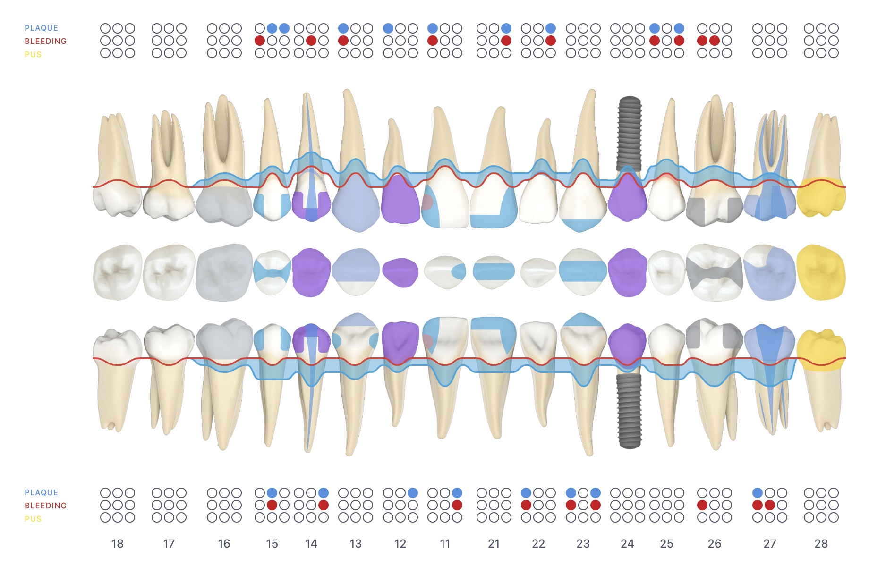
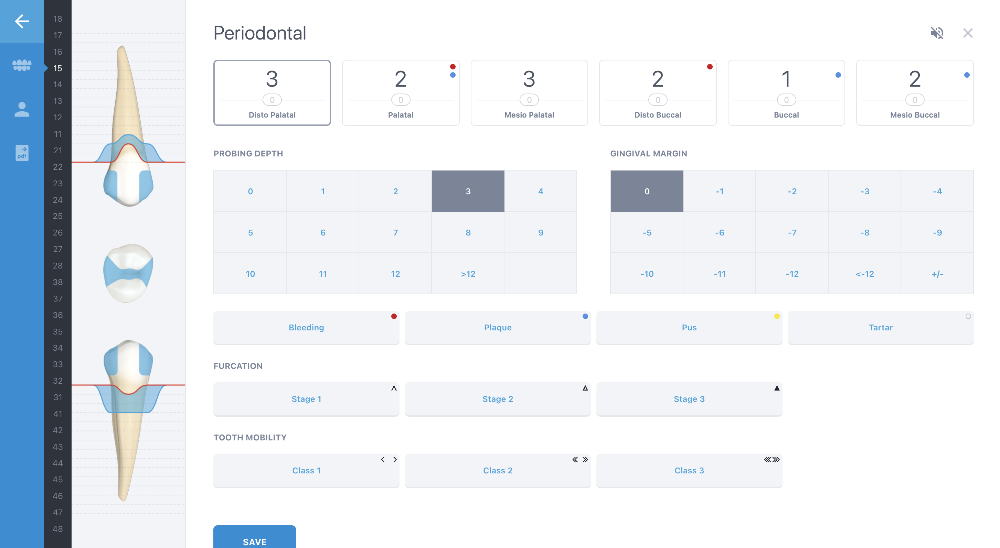
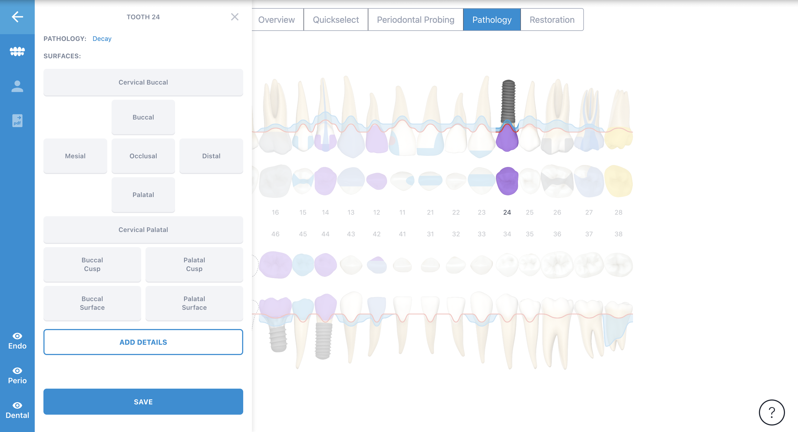
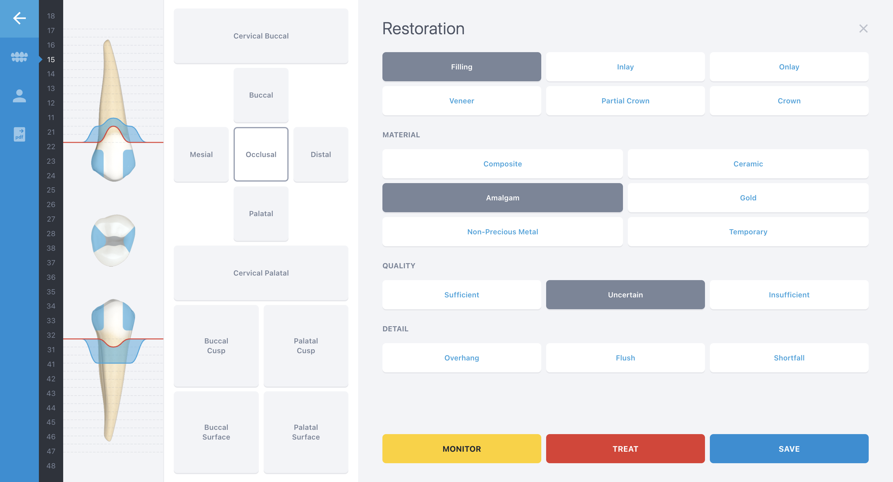
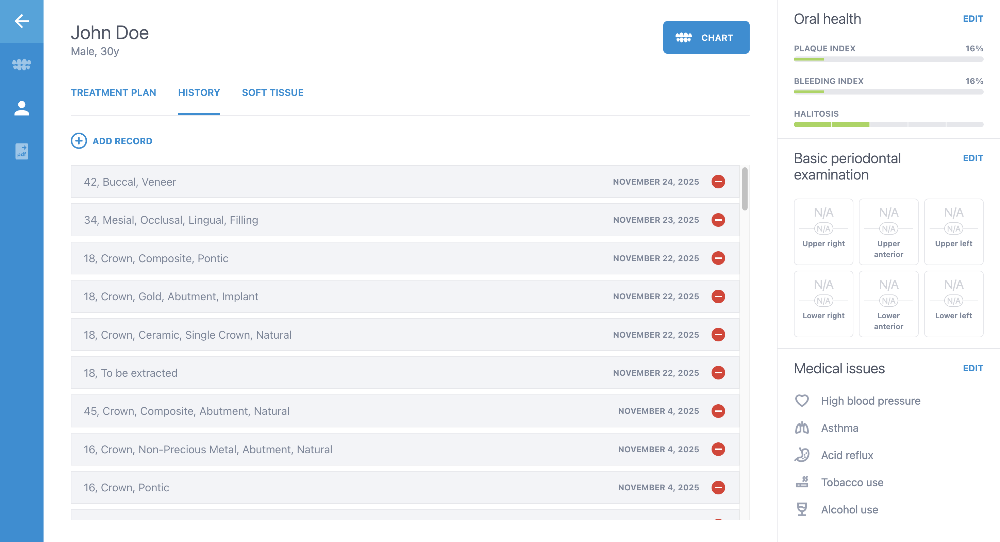

# 🦷 Dental Chart - Digital Dental Application

A modern web application for managing dental charts, treatment planning, and oral health monitoring.



## 📋 About the Project

**Dental Chart** is a comprehensive web application for dental practices, offering complete patient and dental treatment management. The application uses the ISO 3950 numbering system and provides detailed visualizations for each tooth on 3 planes: frontal, occlusal, and lingual.

## ✨ Key Features

### 🏥 Patient Management
- **Patient List** with search and filter functionality
- **Patient Dashboard** with complete history
- **Treatment Plan** personalized for each patient
- **Treatment History** with time-travel (chronological visualization)
- **Soft Tissue Exam**
- **Oral Health Metrics**
- **BPE (Basic Periodontal Examination)** with risk codes
- **Medical Issues** and alerts

### 📊 Dental Charting



#### Multiple Views
- **Chart Overview** - Complete visualization with 4 rows:
  - Upper Buccal (18-11, 21-28)
  - Upper Occlusal
  - Lower Occlusal  
  - Lower Buccal (48-41, 31-38)
- **Quick Select** - Rapid charting interface
- **Periodontal Probing** - Full-screen interface for periodontal measurements
- **Pathology View** - Pathology marking
- **Restoration View** - Restoration planning

#### View Toggles
- 🔴 **Endo** - Show/hide root canals
- 🟢 **Perio** - Show/hide gingival data
- 🔵 **Dental** - Show/hide restorations

### 🦷 Tooth Detail Page

Each tooth can be viewed in detail with:

#### 3-Plane 3D Visualization
- **Frontal View** - Front view
- **Top View** - Occlusal view
- **Lingual View** - Lingual view

#### Data Tabs
1. **Overview** - General information
2. **Endodontic** (5 tests):
   - Percussion sensitivity
   - Palpation sensitivity
   - Vitality tests
   - Response to stimuli
   - Root canal assessment

3. **Periodontal** (6-site measurements):
   
   - Pocket depth
   - Gingival recession
   - Attachment level
   - Bleeding on probing
   - Mobility
   - Furcation

4. **Pathology** (6 categories):
   
   - Caries
   - Fractures
   - Resorptions
   - Infections
   - Periapical lesions
   - Other pathologies

5. **Restoration** (9 types):
   
   - Amalgam
   - Composite
   - Crowns
   - Bridges
   - Implants
   - Veneers
   - Inlay/Onlay
   - Temporary fillings
   - Others

### 📈 Dashboard & History



- Detailed treatment plan
- Complete treatment history
- Soft tissue examination
- Sidebar with important metrics:
  - Oral Health Metrics
  - BPE with risk codes
  - Medical Issues & Alerts

### 📄 Reports
- **Report type selection** customizable
- **Report preview** in real-time
- **Export options**:
  - PDF Export
  - Print
  - Email

### 🎨 Layer System (Z-Index)
```
Layer 8: Selection Highlight (top-most)
Layer 7: Annotations
Layer 6: Periodontal Data
Layer 5: Endodontic Indicators
Layer 4: Pathology Markers
Layer 3: Restorations
Layer 2: Gingival Tissue
Layer 1: Base Tooth Images (bottom)
```

## 🏗️ Technical Architecture

### Technology Stack
- **Frontend**: React 18 + Vite
- **Routing**: React Router v6
- **State Management**: Zustand
- **Styling**: Modern CSS with CSS variables
- **Animations**: CSS Animations & Transitions

### State Management Structure (Zustand)

```javascript
authStore          // Authentication & user
patientStore       // Patient management
chartStore         // Dental chart & views
toothStore         // Tooth-specific data
dashboardStore     // Dashboard & metrics
```

### Image Assets
- **330+ tooth images** in `src/assets/teeth/`
- Each tooth has:
  - Frontal view (normal, implant, missing, no-roots)
  - Occlusal view (top view)
  - Lingual view
- **Automatic mirroring** for symmetric teeth:
  - 11-18 → Used directly
  - 21-28 → Mirror 11-18 horizontally
  - 41-48 → Used directly
  - 31-38 → Mirror 41-48 horizontally

### Numbering System (ISO 3950)

```
                     Upper Jaw
                RIGHT    |    LEFT
 18 17 16 15 14 13 12 11 | 21 22 23 24 25 26 27 28
━━━━━━━━━━━━━━━━━━━━━━━━━━━━━━━━━━━━━━━━━━━━━━━━━
 48 47 46 45 44 43 42 41 | 31 32 33 34 35 36 37 38
                RIGHT    |    LEFT
                     Lower Jaw

Deciduous (Baby Teeth):
        Upper: 55 54 53 52 51 | 61 62 63 64 65
        Lower: 85 84 83 82 81 | 71 72 73 74 75
```

## 📱 Responsive Design

| Breakpoint | Layout | Features |
|------------|--------|----------|
| **Desktop** (1400px+) | Full layout | 4-jaw view, all features visible |
| **Laptop** (1024-1399px) | Compact layout | 4-jaw view, most features |
| **Tablet** (768-1023px) | 2-jaw view | Simplified controls, bottom sheets |
| **Mobile** (<768px) | Single jaw | Bottom navigation, full-screen modals |


## 📁 File Structure

```
dchart-oneshot/
├── public/
│   └── overview/           # Screenshots & overview images
├── src/
│   ├── assets/
│   │   └── teeth/          # 330+ tooth images
│   ├── components/
│   │   ├── Tooth/          # Tooth visualization components
│   │   ├── Chart/          # Chart components
│   │   └── ...
│   ├── pages/
│   │   ├── HomePage.jsx
│   │   ├── PatientsListPage.jsx
│   │   ├── PatientDashboardPage.jsx
│   │   ├── PatientChartPage.jsx
│   │   ├── PatientReportPage.jsx
│   │   └── ToothDetailPage.jsx
│   ├── stores/             # Zustand stores
│   │   ├── authStore.js
│   │   ├── patientStore.js
│   │   ├── chartStore.js
│   │   ├── toothStore.js
│   │   └── dashboardStore.js
│   ├── llm-build-spec/     # one shot skeleton
│   └── App.jsx
└── package.json
```

## ✅ Implementation Status Checklist

### Phase 1: Foundation ✅
- [x] Project setup (React + Vite)
- [x] Routing configuration
- [x] Zustand stores implementation
- [x] Global Sidebar
- [x] Base structure

### Phase 2: Core Charting ✅
- [x] ToothRenderer Component
- [x] JawRow Component
- [x] ChartOverview Page
- [x] Click-to-detail navigation
- [x] ToothDetailPage Layout
- [x] 3-plane tooth visualization

### Phase 3: Advanced Features 🚧
- [x] Periodontal Probing (full-screen interface)
- [x] Pathology Menu (6 categories)
- [x] Restoration Menu (9 types)
- [x] Endodontic Tests (5 tests)
- [x] Quick Select charting
- [/] Time Travel (in progress)
- [ ] Annotations system

### Phase 4: Dashboard & Reports 🚧
- [x] Patient Dashboard layout
- [x] Treatment Plan component
- [x] Treatment History
- [x] Soft Tissue Exam
- [x] Oral Health Metrics sidebar
- [x] BPE calculations
- [x] Medical Issues tracking
- [/] Report generator (in progress)
- [ ] PDF Export functionality
- [ ] Email integration

### Phase 5: Enhancement & Polish 📋
- [ ] Performance optimization
- [ ] Unit tests
- [ ] End-to-end tests
- [ ] User documentation
- [ ] Accessibility (WCAG 2.1)
- [ ] Multi-language support
- [ ] Dark mode
- [ ] Backup & restore

### Future Features 🔮
- [ ] Radiographic image integration
- [ ] Interactive 3D charting
- [ ] Machine learning for caries detection
- [ ] Calendar & appointment integration
- [ ] External API integrations

## 🎯 Roadmap 2025-2026

**2025**
- ✅ Core charting functionality
- ✅ Tooth detail views

**Q1 2026**
- 🚧 Advanced charting features
- 🚧 Report generation
- 📋 Dashboard completion
- 📋 Export functionality
- 📋 Performance optimization
- 📋 Testing suite
- 📋 User documentation

**Q2 2026**
- 🔮 Advanced features
- 🔮 Mobile app
- 🔮 Machine learning for caries detection
- 🔮 Calendar & appointment integration
- 🔮 External API integrations

**Version**: 1.0.0-beta  
**Last updated**: December 22, 2024

For questions or support, contact the development team.
