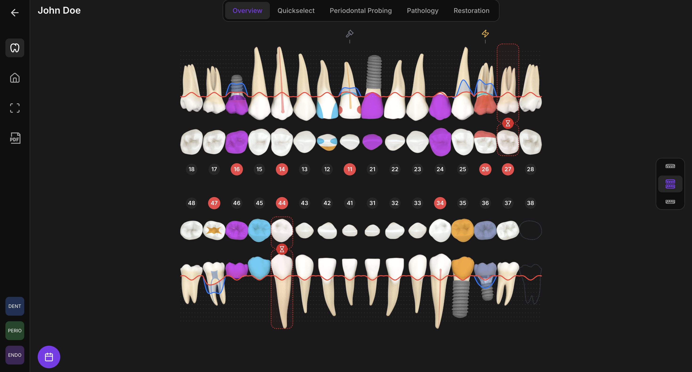
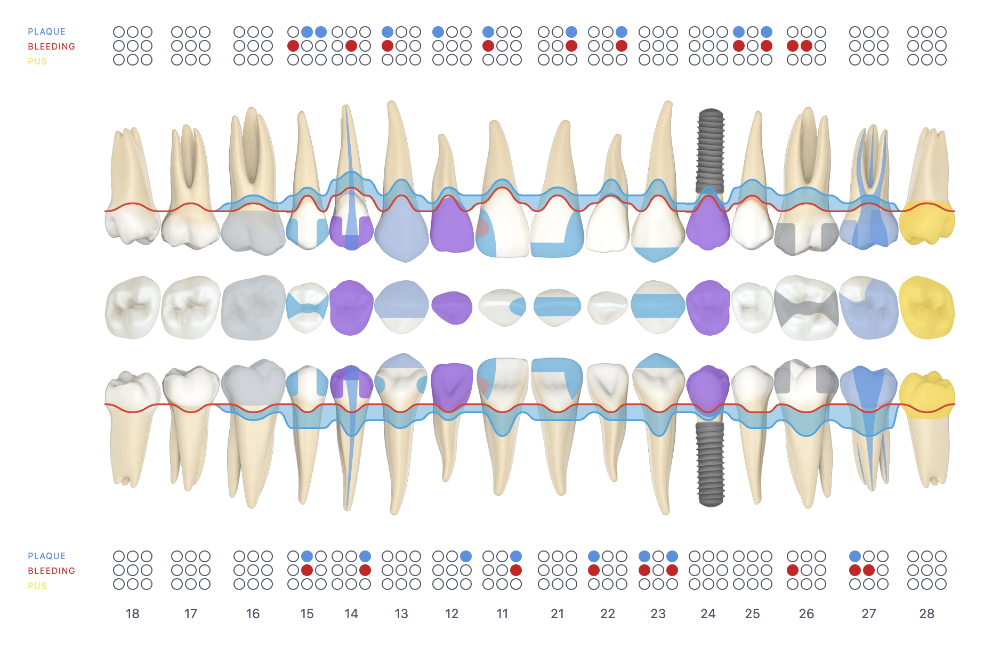

# 🦷 Dental Chart — Digital Dental Application

A modern web application for managing dental charts, treatment planning, and oral health monitoring.



## 📋 About

**Dental Chart** is a full-stack web application for dental practices. It uses the **ISO 3950 numbering** system and provides detailed 3-plane (frontal, occlusal, lingual) visualizations for each tooth. The data model is **event-sourced**: the Chart is a visual projection of History (completed interventions) and Treatment Plan (planned/monitoring interventions).

---

## 🏗️ Architecture Overview

```
┌──────────────────────────────────────────────────────────────┐
│  FRONTEND (React 18 + Vite)                                   │
│                                                                │
│  Pages ──→ AppFacade ──→ PatientAdapter ──→ apiClient ──→ API │
│    ↕                         ↕                                 │
│  Zustand Store          Domain Model                           │
│  (patientSlice,         (PatientBuilder,                       │
│   chartSlice,            PatientModel)                         │
│   medicSlice)                                                  │
└──────────────────────────────────────────────────────────────┘
         ↕ HTTP (REST)
┌──────────────────────────────────────────────────────────────┐
│  BACKEND (Node.js + Express)                                  │
│                                                                │
│  Routes ──→ Controllers ──→ Services ──→ Repositories ──→ DB │
│                                                                │
│  Single-Table DynamoDB Design                                 │
│  PK: PATIENT#<id> | MEDIC#<id> | CLINIC#<id>                 │
│  SK: METADATA# | HISTORY# | PLAN#                            │
└──────────────────────────────────────────────────────────────┘
```

### Technology Stack

| Layer | Technology |
|-------|-----------|
| Frontend | React 18, Vite, Zustand, React Router v6 |
| Styling | Vanilla CSS with CSS Variables |
| Backend | Node.js, Express |
| Database | Amazon DynamoDB (Single-Table Design) |
| State | Zustand (slices: patient, chart, medic) |

---

## 📊 Data Flow

The application follows a hierarchical navigation pattern:

```
Patient List → Patient Dashboard → Patient Chart → Tooth Detail
                    │                    │               │
                    │                    │               ├── Overview
                    │                    │               ├── Endodontic
                    │                    │               ├── Periodontal
                    │                    │               ├── Pathology
                    │                    │               └── Restoration
                    │                    │
                    │                    ├── Chart Overview (dental/perio/endo layers)
                    │                    ├── Quickselect
                    │                    ├── Periodontal Probing
                    │                    ├── Pathology View
                    │                    └── Restoration View
                    │
                    ├── Treatment Plan
                    ├── History
                    ├── Soft Tissue
                    ├── Oral Health Metrics
                    ├── BPE (Basic Periodontal Examination)
                    └── Medical Issues
```

### Domain Model (standardized `name` field)

```javascript
// Patient domain object (as seen by frontend)
{
  id: string,
  medicId: string,
  name: string,          // Standardized — used everywhere
  email: string,         // Optional
  phone: string,         // Optional
  dateOfBirth: string,
  gender: string,
  lastExamDate: string,
  treatmentPlan: { items: [...] },
  history: { completedItems: [...] },
  chart: { teeth: { [toothNumber]: { pathology, restoration, endodontic, periodontal } } },
  oralHealth: { plaqueIndex, bleedingIndex, halitosis },
  bpe: { upperRight, upperAnterior, upperLeft, lowerRight, lowerAnterior, lowerLeft },
  medicalIssues: { highBloodPressure, asthma, allergies, other }
}
```

### Data Transformation Pipeline

```
Backend DB           →    PatientAdapter.toDomain()    →    Frontend Store
(name, items, etc.)       (PatientBuilder)                  (Zustand)

Frontend Store       →    PatientAdapter.toApi()       →    Backend DB
(name, chart, etc.)       (strips UI-only fields)          (DynamoDB)
```

---

## 🔌 API Routes

| Method | Path | Description |
|--------|------|-------------|
| `POST` | `/api/auth/register` | Register medic account |
| `POST` | `/api/auth/login` | Login |
| `GET` | `/api/auth/me` | Get current user |
| `GET` | `/api/medics/:id/patients` | List patients for a medic |
| `POST` | `/api/patients` | Create patient |
| `GET` | `/api/patients/:id` | Get patient metadata |
| `GET` | `/api/patients/:id/chart` | Get full patient record (metadata + history + plan) |
| `PUT` | `/api/patients/:id` | Update patient (splits into METADATA, HISTORY, PLAN) |
| `DELETE` | `/api/patients/:id` | Delete patient and all sub-records |
| `POST` | `/api/patients/:patientId/history` | Add history record |
| `GET` | `/api/patients/:patientId/history` | Get patient history |
| `POST` | `/api/patients/:patientId/treatment-plans` | Add treatment plan item |
| `GET` | `/api/patients/:patientId/treatment-plans` | Get treatment plans |
| `POST` | `/api/ai/analyze` | Analyze X-ray via Modal (with local fallback) |
| `GET` | `/public/detections.json` | Static fallback for AI detections |

---

## 🔬 AI Analysis Pipeline

The application includes an automated dental X-ray analysis pipeline hosted on **Modal**.

### Architecture
The pipeline now uses two specialized models:

1. **YOLO11-seg** – segments every tooth in the panoramic X-ray and assigns the **FDI (ISO 3950)** number.
   - 33 classes: `11–18`, `21–28`, `31–38`, `41–48`, `91`.
2. **ResNet18** – classifies the clinical status of each tooth from a masked crop of the segmented tooth.
   - 7 classes:
     - 0 = Tooth without anomalies
     - 1 = Tooth with fillings
     - 2 = Tooth with RCT
     - 3 = Tooth with crown
     - 4 = Tooth with caries
     - 5 = Residual root
     - 6 = Tooth with RCT and crown

- **Dataset**: Kaggle `zwbzwb12341234/a-dual-labeled-dataset` (Labelme JSON annotations; images in `images1/`).
- **Status label source**: the `group_id` field in each Labelme polygon (`null` = normal = 0).
- **Training**: runs on **Modal** GPUs (`L40S` by default). Dataset and trained models are persisted in a Modal volume; nothing is kept locally.

### Pipeline Commands

All commands are run from the `modal-pipeline/models/` directory or via `modal run modal-pipeline/models/<script>.py`.

| Step | Command |
|------|---------|
| Dataset preparation | `modal run modal-pipeline/models/data_preparation.py` |
| FDI segmentation training | `modal run modal-pipeline/models/train.py` |
| Status classifier training | `modal run modal-pipeline/models/train_status.py` |
| Resume status training | `modal run modal-pipeline/models/train_status.py --resume true` |
| Deploy inference endpoint | `modal deploy modal-pipeline/models/inference.py` |

The inference endpoint exposes a `POST` route that accepts the raw X-ray image bytes and returns a JSON with each detected tooth (`fdi`, `bbox`, `contour`, `status`).

### Local Fallback (Mock Mode)
When the cloud AI service is inactive or `AI_ANALYSIS_ENABLED=false` in `.env`, the backend automatically serves:
- **Image**: `/public/chart2.png` (Panoramic sample)
- **Detections**: `/public/detections.json` (Pre-calculated results in the new `teeth` + `status` format)

---

## ✨ Features

### Patient Management
- Patient CRUD with optional email/phone
- Search and filter
- Treatment Plan with status tracking
- History with time-travel (chronological visualization)
- Oral Health Metrics, BPE, Medical Issues panels

### Dental Charting



**Views**: Overview, Quickselect, Periodontal Probing, Pathology, Restoration

**Layer System** (Z-Index):
```
Layer 8: Selection Highlight
Layer 7: Annotations
Layer 6: Periodontal Data
Layer 5: Endodontic Indicators
Layer 4: Pathology Markers
Layer 3: Restorations
Layer 2: Gingival Tissue
Layer 1: Base Tooth Images
```

**View Toggles**: Endo 🔴 | Perio 🟢 | Dental 🔵

### Tooth Detail (3-plane visualization)

Each tooth has Frontal, Occlusal, and Lingual views plus 5 data tabs:

1. **Overview** — General info
2. **Endodontic** — Percussion, palpation, vitality, stimuli response, root canal
3. **Periodontal** — 6-site pocket depth, recession, attachment, bleeding, mobility, furcation
4. **Pathology** — Caries, fractures, resorptions, infections, periapical, other
5. **Restoration** — Amalgam, composite, crowns, bridges, implants, veneers, inlay/onlay, temporary, others

### ISO 3950 Numbering System

```
                     Upper Jaw
                RIGHT    |    LEFT
 18 17 16 15 14 13 12 11 | 21 22 23 24 25 26 27 28
━━━━━━━━━━━━━━━━━━━━━━━━━━━━━━━━━━━━━━━━━━━━━━━━━
 48 47 46 45 44 43 42 41 | 31 32 33 34 35 36 37 38
                RIGHT    |    LEFT
                     Lower Jaw
```

---

## 📁 Project Structure

```
dchart-oneshot/
├── server/                         # Backend (Node.js + Express)
│   └── src/
│       ├── config/                 # DynamoDB client config
│       ├── controllers/            # Route handlers
│       ├── models/
│       │   ├── Enums.js            # Constants (Gender, ToothZone, Material, etc.)
│       │   └── repositories/       # DynamoDB data access (Single-Table)
│       │       ├── BaseRepository.js       # Outgoing/incoming transformations
│       │       ├── PatientRepository.js    # PATIENT#<id> + METADATA#
│       │       ├── HistoryRepository.js    # PATIENT#<id> + HISTORY#
│       │       ├── TreatmentPlanRepository.js  # PATIENT#<id> + PLAN#
│       │       └── MedicRepository.js      # MEDIC#<id> + METADATA#
│       ├── services/               # Business logic
│       ├── routes/api.js           # Route definitions
│       └── utils/mockData.js       # Seed data templates
│
├── src/                            # Frontend (React 18 + Vite)
│   ├── api/                        # HTTP client & service layer
│   │   ├── apiClient.js            # Fetch wrapper
│   │   ├── authService.js          # Auth endpoints
│   │   └── patientService.js       # Patient CRUD endpoints
│   ├── core/                       # Domain layer
│   │   ├── adapters/PatientAdapter.js   # API ↔ Domain translation
│   │   ├── builders/PatientBuilder.js   # Builder pattern for Patient
│   │   ├── models/PatientModel.js       # Business logic (completeTreatment, addToHistory)
│   │   ├── store/appStore.js            # Zustand root store
│   │   ├── store/slices/                # patientSlice, chartSlice, medicSlice
│   │   └── AppFacade.js                 # Central UI ↔ Domain entry point
│   ├── components/
│   │   ├── Chart/                  # Chart views (Overview, Quickselect, Perio, etc.)
│   │   ├── Dashboard/              # TreatmentPlan, History, OralHealth, BPE, MedicalIssues
│   │   ├── Drawers/                # Pathology/Restoration drawers
│   │   ├── Tooth/                  # Tooth visualization components
│   │   └── UI/                     # PatientModal, SettingsModal, etc.
│   ├── pages/                      # Route pages
│   │   ├── HomePage.jsx            # Login/Signup
│   │   ├── PatientsListPage.jsx    # Patient list with search
│   │   ├── PatientDashboardPage.jsx # Patient detail (dashboard)
│   │   ├── PatientChartPage.jsx    # Dental chart
│   │   ├── ToothDetailPage.jsx     # Individual tooth detail
│   │   └── PatientReportPage.jsx   # Reports
│   ├── assets/teeth/               # 330+ tooth images
│   └── utils/mockData.js           # Frontend mock data
└── package.json
```

---

## 🚀 Getting Started

### Prerequisites
- Node.js 18+
- AWS DynamoDB (local or cloud) with a table named `DentalChart` (PK + SK keys)

### Backend
```bash
cd server
npm install
# Set env vars: DYNAMODB_TABLE_NAME, AWS credentials
npm run dev
```

### Frontend
```bash
npm install
npm run dev
```

---

**Version**: 1.0.0-beta
**Last updated**: March 2026
## Architecture Map

- Open [docs/architecture-map.md](/Users/adriantucicovenco/Proiecte/dchart-oneshot/docs/architecture-map.md) with `markmap-vscode` for a navigable project mindmap.
- Use it together with CodeGraphy: CodeGraphy shows imports, while the architecture map explains why files exist and how features are grouped.
