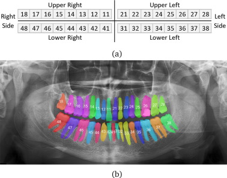
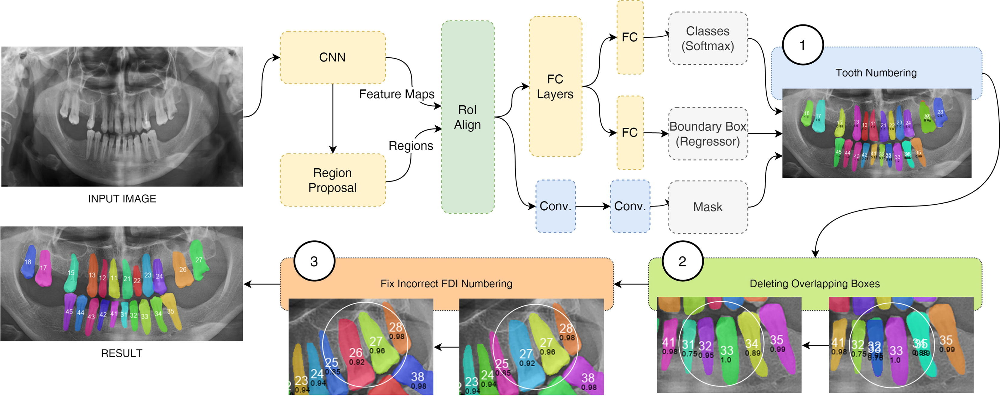
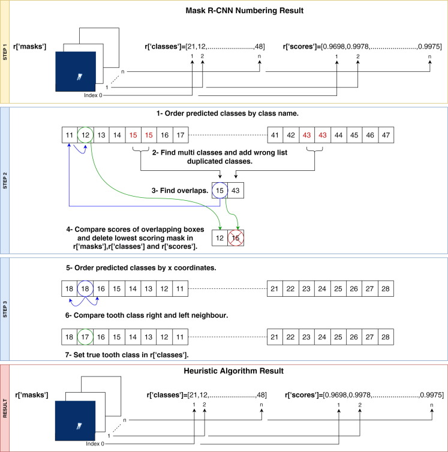
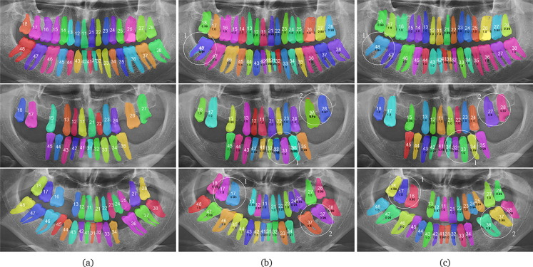

# 🦷 Dental Tooth Segmentation Pipeline (Modal)

This pipeline trains and runs inference for identifying every tooth in panoramic dental X-rays, numbering them with FDI (ISO) notation, and classifying their clinical status using the Modal cloud platform.



## 📁 Architecture (3 steps)

1. **YOLO11-seg** – segments each tooth and assigns the FDI number (33 classes: 11–48, 91).
2. **Heuristic post-processing** – corrects FDI numbering errors (duplicate detections, missing-teeth sequence gaps, neighbour inconsistencies).
3. **ResNet18** – classifies the status of each tooth from a masked crop (7 classes):
   - 0 = Tooth without anomalies
   - 1 = Tooth with fillings
   - 2 = Tooth with RCT
   - 3 = Tooth with crown
   - 4 = Tooth with caries
   - 5 = Residual root
   - 6 = Tooth with RCT and crown



## 📦 Setup

### 1. Install Modal CLI
```bash
pipx install modal
pipx ensurepath
```

### 2. Create Kaggle secret
```bash
modal secret create kaggle-creds KAGGLE_USERNAME=<username> KAGGLE_KEY=<key>
```

## 🚀 Commands

### Dataset preparation
Download the Kaggle dataset into the persistent Modal volume and convert Labelme annotations to YOLO segmentation + status crops.

```bash
modal run modal-pipeline/models/data_preparation.py
```

Force re-download:
```bash
modal run modal-pipeline/models/data_preparation.py --force-download true
```

### FDI training (segmentation + numbering)
```bash
modal run modal-pipeline/models/train.py
```

Parameters:
- `--epochs` (default 100)
- `--batch-size` (default 16)
- `--model-size` (default `x`, options: n, s, m, l, x)

### Status classifier training
```bash
modal run modal-pipeline/models/train_status.py
```

Parameters:
- `--epochs` (default 30)
- `--batch-size` (default 32)
- `--learning-rate` (default 0.001)

### Running in the background
Use Modal's detached run so training continues even if you close the terminal:

```bash
modal run --detach modal-pipeline/models/train_status.py
```

Modal will print a run ID. To stream logs:

```bash
modal logs <run-id>
```

To list active runs:

```bash
modal run list
```

You can also use the Modal web dashboard to watch logs and metrics.

### Inference

```bash
modal run modal-pipeline/models/inference.py
```

By default, inference runs the FDI numbering heuristic (`use_heuristic=True`). It can be disabled by passing `use_heuristic=False` to `_run_prediction_core` if you need raw YOLO output.

The heuristic performs three steps before status classification:
1. **Overlap suppression** – removes duplicate predictions for the same physical tooth, keeping the higher-confidence FDI label.
2. **Jaw splitting** – divides detections into upper and lower jaw by median y-coordinate.
3. **Sequence correction** – sorts each jaw by x-coordinate, aligns it with the expected FDI sequence (allowing gaps for missing teeth), and reassigns low-confidence labels that break the sequence.



Example output:
```json
{
  "teeth": [
    {
      "fdi": "16",
      "confidence_fdi": 0.92,
      "bbox": [x1, y1, x2, y2],
      "contour": [[x1, y1], ...],
      "status": {
        "status_id": 3,
        "status_name": "Tooth with crown",
        "confidence": 0.85
      }
    }
  ],
  "count": 28
}
```

When the heuristic changes a label, the response also includes `fdi_original` and `corrected_by_heuristic: true`.

## Example result



## ⚙️ Dataset notes

- Source: Kaggle `zwbzwb12341234/a-dual-labeled-dataset`.
- Input format: images in `images1/` and Labelme JSON labels in `labels/`.
- Status is extracted from the `group_id` field of each shape (`null` = 0 = normal).
- Generated dataset is saved in the persistent `dental-data-storage` volume at `/data/dataset/`.

## ⚙️ Cost / GPU notes

- `data_preparation.py` runs on CPU and does not need a GPU.
- `train.py` and `train_status.py` use `L40S` by default for faster training.
- If you want to reduce cost, switch to `A10G` in the `@app.function` decorator, but training will take longer.
- The status classifier loads all masked crops into VM memory before training, avoiding slow repeated reads from the volume.
