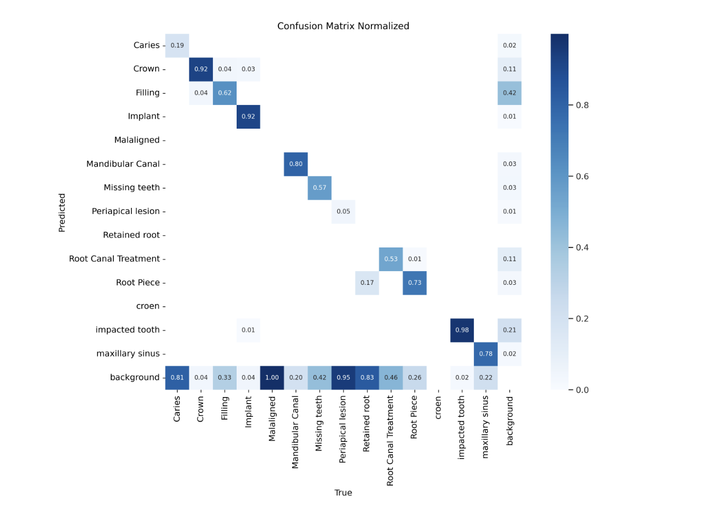
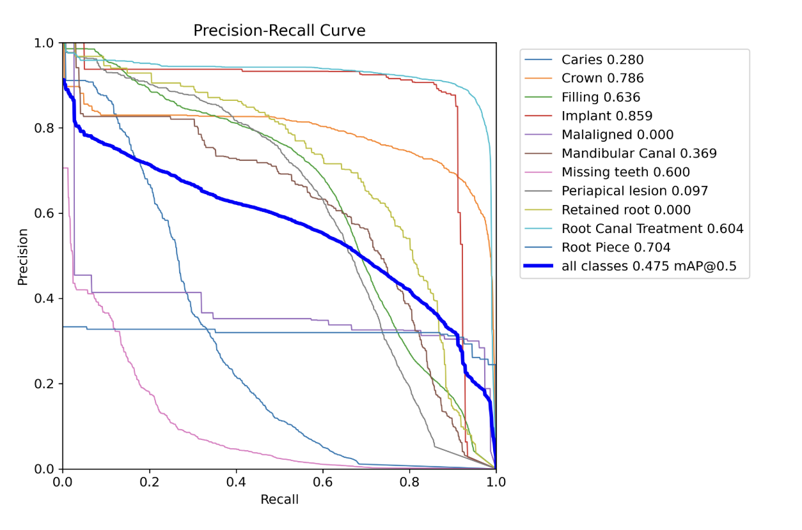
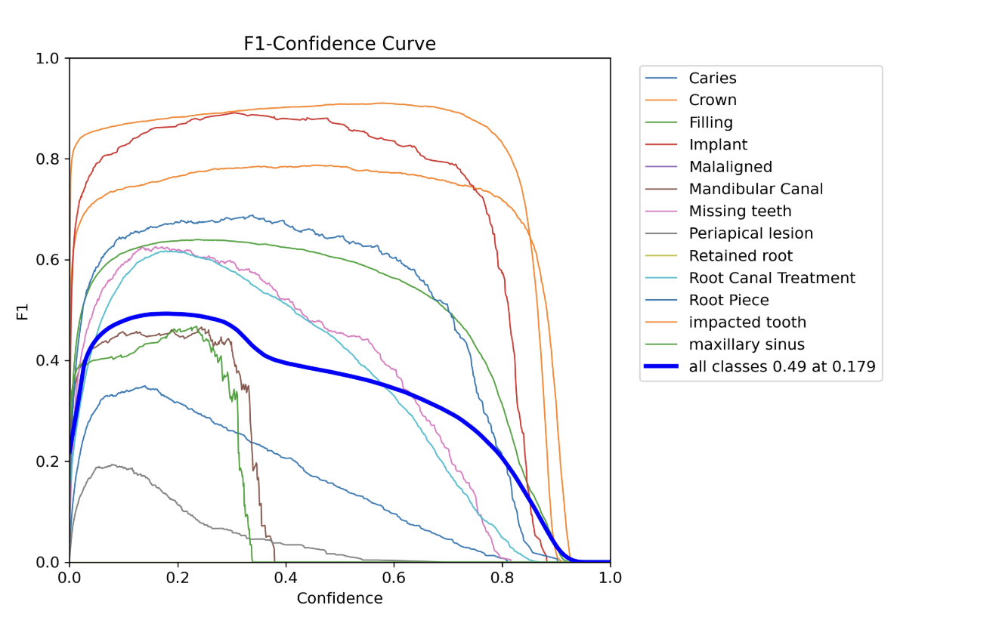

# 🧬 Training Report: Dental Detection Model

This report documents the methodology and results achieved during the training of the custom YOLOv8 model for dental X-ray analysis.

## 📋 Methodology

- **Base Architecture**: YOLOv8s (Small).
- **Dataset**: `dental-datasetv6` (31 distinct clinical categories).
- **Epochs**: 50 (with `patience=10`).
- **Batch Size**: 8.
- **Input Resolution**: 640x640 pixels (imgsz=640).
- **Optimizer**: AdamW.
- **Learning Rate Schedule**: Cosine LR (`cos_lr=True`).
- **Data Augmentation**: 
  - `mosaic=1.0`
  - `mixup=0.2`
  - `flipud=0.5`, `fliplr=0.5`
  - `degrees=5`, `translate=0.1`
- **Preprocessing Strategy**: "Squash to Square" (Resize omitting aspect ratio).
- **Environment**: Trained with high-performance GPU acceleration.

## 🏷️ Target Classes (31)
The model distinguishes between 31 clinical findings, including:
`Caries`, `Crown`, `Filling`, `Implant`, `Missing teeth`, `Root Canal Treatment`, `Impacted tooth`, `Mandibular Canal`, `Maxillary Sinus`, `Bone Loss`, etc.

## 📊 Performance Metrics

The following metrics illustrate the model's accuracy after 100 epochs:

### Confusion Matrix
The confusion matrix shows the model's ability to correctly classify findings versus background or other classes.

### Precision Correlation
Precision reflects the quality of the detections (avoiding false positives).

### Recall Analysis
Recall reflects the model's ability to find all relevant objects (avoiding false negatives).

## 🛠️ Deployment Notes
The model is exported as `best.pt` and is integrated into the `inference.py` pipeline. It expects a raw 640x640 input, which is handled automatically by the preprocessing script.
