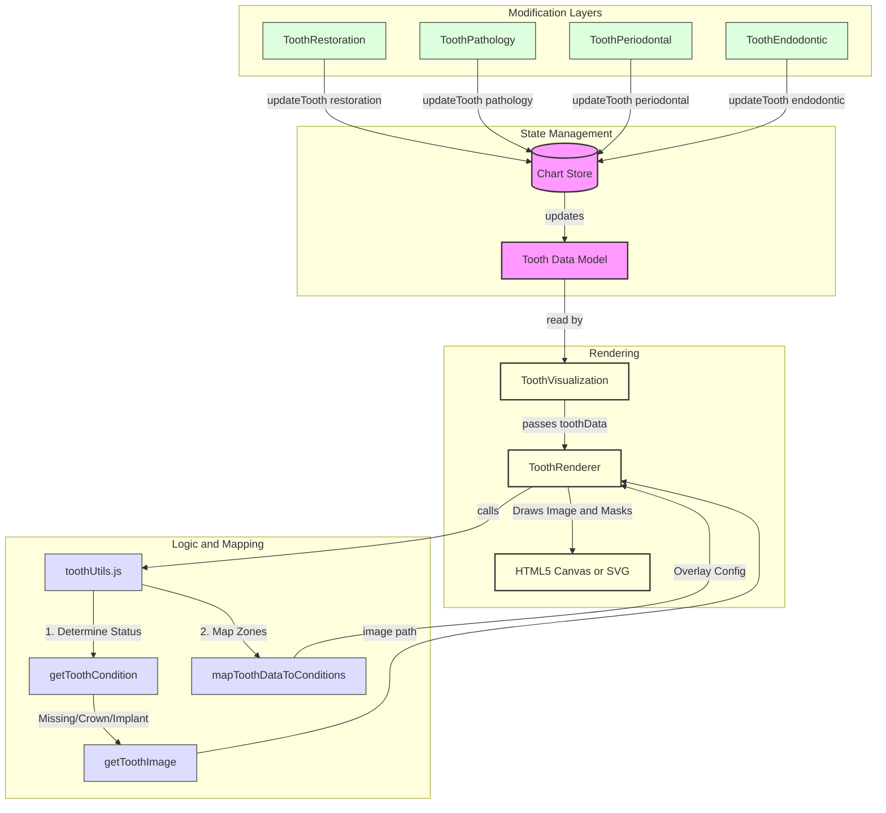

# Project Architecture: Tooth Interaction Flow

This diagram illustrates how the different functional modules (Restoration, Pathology, etc.) interact with the central Tooth data throughout the application.

## 1. Concept Overview

The application follows a **Unidirectional Data Flow**:

1.  **Editors** (Restoration, Pathology, etc.) collect user input and update the **Store**.
2.  **Store** holds the "Source of Truth" (`Tooth` object).
3.  **Utils** transform this data into visual logic (images, colors, masks).
4.  **Renderer** receives the processed data and draws the tooth.

## 2. Interaction Diagram



## Key Components

### 1. The Editors (Controllers)
These components are responsible for specific domains of the tooth. They don't draw the tooth themselves; they **modify the data**.
*   **ToothRestoration**: Handles fillings, crowns, veneers. Updates `tooth.restoration`.
*   **ToothPathology**: Handles decay, fractures. Updates `tooth.pathology`.
*   **ToothPeriodontal**: Handles pockets, mobility. Updates `tooth.periodontal`.
*   **ToothEndodontic**: Handles nerve status, tests. Updates `tooth.endodontic`.

### 2. The Data (Model)
The `Tooth` object (defined in `ToothModels.js`) is the contract between all parts.
```javascript
{
  toothNumber: 11,
  isMissing: false,
  restoration: { crowns: [], fillings: [] },
  pathology: { decay: [] },
  periodontal: { sites: {} },
  // ...
}
```

### 3. The Visualizer (View)
*   **ToothRenderer**: The "dumb" component that just renders what it's told.
*   **toothUtils.js**: The "brain" that translations data into visuals. It decides:
    *   "If crown > base=Implant" -> show `_implant.png`.
    *   "If decay on Mesial" -> Return Red Mask on Mesial zone.
